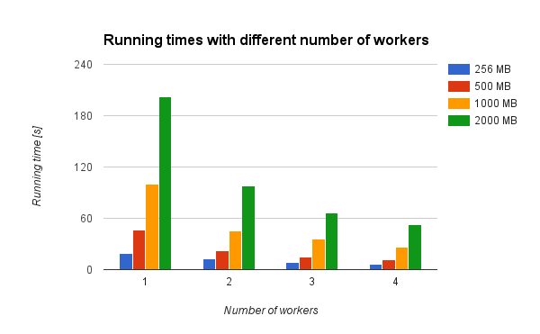

.. _section-experiments:

===========
Experiments
===========

To test our system we have performed several experiments. These are described
in the sections below.

Real World Dataset And Scalability
==================================

We want to test if our system could handle a real world dataset. To test this
we compiled a dataset with 550960 sequences from different organisms containing 
the amino acid sequence of a "ribosome": the cellular machine that converts 
RNA to a protein. Practically all life forms have this machine. This dataset 
is downloaded from Uniprot [uniprot]_, a collaboration between different 
institutions providing annotated protein sequences. The 550960 sequences result in a dataset of 253MB.
To see how our system scales with an even larger dataset, we duplicate the data
and create a few more "artificial" datasets of 506 MB, 1012 and 2024 MB.

We measure the running time as follows: from the moment the manager puts the
first subtask on the queue until all subtasks have finished. This does not
include the preprocessing stage (to determine proper byte splitting offsets),
but does include the transfer of data chunks from the data nodes to the worker
nodes.

The experiment is run on the trial version of Google Compute Engine, which
limits the number of VM instances. We measured the running time with one, two,
three and four available worker nodes. The running times can be seen in
:numref:`fig-running-times`. To see how the performance is affected with even
more worker nodes is recommended for future work.

.. _fig-running-times:

    The runtime of each job with different number of available workers.

As you can see in the figure, the running time decreases a lot when more worker
nodes are added.

Fault Tolerance
===============

Our requirements state that our system should be able to handle at most one
node down of each kind at the same time. Furthermore, when a worker node dies
while processing a subtask, this subtask should not be forgotten. 

Worker Nodes
------------

When we manually kill a worker while processing a task, we see that RabbitMQ
notices this, and automatically requeues the corresponding subtask. An other
available worker can pick this task at a later time. 

Data Nodes
----------

All datasets are stored on at least two data nodes. We manually shutdown one data 
node. When the worker receives the location of a dataset, but notices that 
this data node is not available, the worker notifies the manager, which in turn 
will mark the data node as unavailable and return the alternate data node.

Managers
--------

Unfortunately we did not have time to properly test the fault tolerance of the
managers. We could not find the time to properly setup and configure pgPool-II
for PostgreSQL replication, and a RabbitMQ cluster which shares the queues.

But any client wanting to connect to a manager, tries connect to a random IP selected from
a configuration file where all manager IP addresses are stored, until one
responds. So when multiple managers are available, it should not be a problem
when one of them goes down.

.. [uniprot]
    UniProt Consortium. "The universal protein resource (UniProt)." *Nucleic 
    acids research* 36.suppl 1 (2008): D190-D195.
